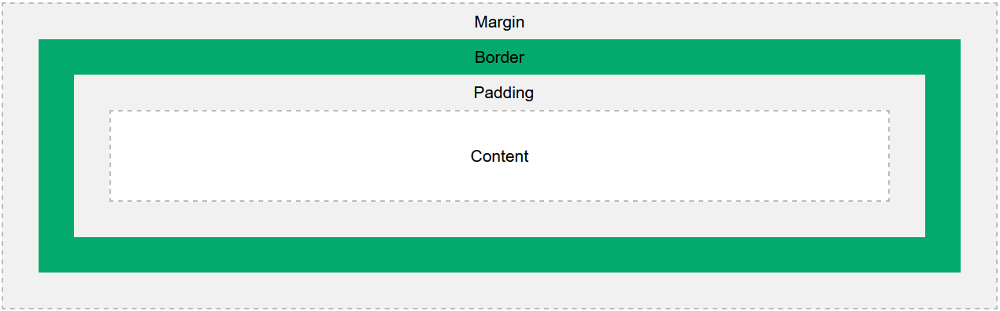

# Cajas

padding \<top> \<right> \<bottom> \<left>
- padding-top
- padding-right
- padding-bottom
- padding-left

border \<width> \<style> \<color>
- border-\<side>-\<attr>
- border-width
- border-style
    - dotted
    - dashed
    - solid
    - double
    - groove: Efecto zanja, bajorelieve
    - ridge: Efecto sobrerelieve
    - inset: Efecto 3D, oscuro arriba.
    - outset: Efecto 3D, oscuro abajo.
    - none
    - hidden
- border-color
- border-radius

outline \<width> \<style> \<color>
- outline-width
- outline-style
- outline-color
- outline-offset

margin \<top> \<right> \<bottom> \<left>
- margin-top
- margin-right
- margin-bottom
- margin-left

visibility: visible | hidden | collapse

box-sizing: <u>content-box</u> | border-box 

overflow | overflow-x | overflow-y
- visible
- hidden
- clip
- scroll
- auto
- overlay

min-width
width
max-width

min-height
height
max-height

display
- block
- inline
- **flex**
- **grid**
- flow-root
- none
- contents
- table
- table-row
- list-item

## [Flow layout](https://developer.mozilla.org/en-US/docs/Web/CSS/CSS_Flow_Layout/Block_and_Inline_Layout_in_Normal_Flow)

## [Grid Layout](https://developer.mozilla.org/en-US/docs/Web/CSS/CSS_Grid_Layout/Basic_Concepts_of_Grid_Layout)

## [Flexbox](https://developer.mozilla.org/en-US/docs/Web/CSS/CSS_Flexible_Box_Layout/Basic_Concepts_of_Flexbox)

flex-direction: row | column

